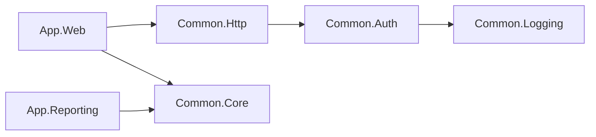
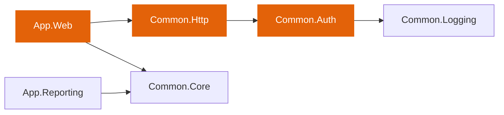
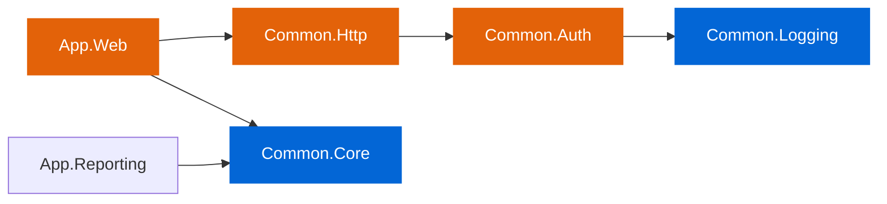

# cycle

A .NET CLI tool that traces the MSBuild project graph for a given set of files and produces a scoped Solution Filter (`.slnf`). It evaluates transitive dependencies, imports, and item references to determine which projects in a solution are related to the input files.

## Quick start

```bash
dotnet tool install cycle
git diff --name-only origin/main...HEAD | dotnet cycle MySolution.slnx affected.slnf
dotnet build affected.slnf
dotnet test affected.slnf
```

## Installation

Cycle requires the .NET SDK, version 8.0 or later.

Install cycle as a local tool with a pinned version.

```bash
dotnet new tool-manifest
dotnet tool install cycle
```

## Usage

```bash
dotnet cycle <solution-path> <output-file> [options]
```

### Arguments

| Argument | Description |
|---|---|
| `solution-path` | Path to the solution file (`.sln` or `.slnx`) |
| `output-file` | Path to write the output file |

### Options

| Option | Description | Default |
|---|---|---|
| `--files <path>` | File containing file paths (one per line) | |
| `--format <format>` | Output format: `slnf` (solution filter) or `txt` (absolute paths, one per line) | `slnf` |
| `--no-closure` | Exclude transitive build dependencies (ProjectReferences) from the filter | `false` |
| `--log-level <level>` | Log verbosity: `quiet`, `minimal`, `normal`, `verbose` | `minimal` |

File paths are read from `--files` if provided, otherwise from stdin when input is piped.

## Examples

Scope a build and test run to only the projects related to files on a feature branch:

```bash
git diff --name-only origin/main...HEAD | dotnet cycle MySolution.slnx affected.slnf
dotnet build affected.slnf
dotnet test affected.slnf
```

Scope to the most recent commit on main:

```bash
git diff --name-only HEAD~1...HEAD | dotnet cycle MySolution.slnx affected.slnf
dotnet build affected.slnf
```

Read file paths from a file:

```bash
dotnet cycle MySolution.slnx affected.slnf --files files.txt
```

Output absolute project paths as plain text:

```bash
git diff --name-only origin/main...HEAD | dotnet cycle MySolution.slnx affected.txt --format txt
```

## How it works

Cycle takes a set of file paths and a solution file, then resolves which projects in that solution are related to those files through the MSBuild project graph. It does this in seven steps.

### 1. Input parsing

The tool reads file paths from the file specified via `--files`, or from standard input when input is piped. Each path is normalized to an absolute path. Paths that cannot be resolved are logged and skipped.

### 2. Solution reading

The tool parses the solution file to discover all project paths contained in the solution.

### 3. Phantom file creation

The tool creates temporary placeholder files for any input file that does not exist on disk. This is necessary because MSBuild evaluates project files by resolving all item includes and globs against the file system. Without these placeholders, projects that reference a deleted or renamed file would fail to evaluate correctly. The tool cleans up the placeholders automatically when processing completes.

### 4. Project loading and evaluation

Each project from the solution is loaded into memory. For each project, the tool collects three sets of information.

First, the resolved item paths: source files, content files, resources, and all other items after glob and property expansion. Second, the import paths: all `.props` and `.targets` files pulled in during evaluation. Third, the ProjectReference paths: direct build dependencies on other projects.

For projects that target multiple frameworks, the tool evaluates the project once per target framework to capture items specific to each framework.

### 5. Project resolution

This step determines which projects are related to the input files. It runs in two phases: direct file matching, followed by reverse dependency propagation. The following example illustrates both phases.

Consider a solution with this dependency graph, where an arrow from A to B means A has a ProjectReference to B.



Suppose one of the input files belongs to Common.Auth. The first phase checks each input file against the resolved item paths and import paths collected in the previous step. The file matches Common.Auth, so Common.Auth is marked as directly matched.

The second phase starts from each directly matched project and walks the reverse dependency graph level by level. Every project that depends on a matched project through a ProjectReference is itself marked as matched. The traversal then continues from each newly matched project, repeating until it finds no further dependents. In this example the walk makes two hops: Common.Http references Common.Auth and is matched in the first hop, then App.Web references Common.Http and is matched in the second hop. App.Reporting does not depend on any matched project and remains outside the result set.



The highlighted nodes represent the result set after this step: Common.Auth as a direct match, Common.Http as a reverse dependent one hop away, and App.Web as a reverse dependent two hops away.

Projects that failed to load during project evaluation are unconditionally added to the result set. This prevents build failures from being silently masked when the output is used in CI.

### 6. Transitive closure

This step ensures that every project needed to compile the result set is included in the solution filter. It runs by default and can be disabled with `--no-closure`.

Starting from the projects identified in step 5, a traversal walks the forward dependency graph level by level. For each matched project, the tool follows its outgoing ProjectReferences and adds the referenced projects to the filter. The traversal continues until all reachable build dependencies have been included.

Continuing the example, App.Web has a ProjectReference to Common.Core, so Common.Core is added. Common.Auth has a ProjectReference to Common.Logging, so Common.Logging is added. The remaining forward references point to projects already in the result set and do not add anything new. The final filter contains every project needed to compile the result set.



The orange nodes are the matched projects from step 5. The blue nodes are build dependencies added by the closure. Together they form the complete set written to the solution filter. App.Reporting is the only project excluded from the filter in this example.

References that point to projects outside the solution cannot be included in the filter. These are reported as warnings but do not prevent the filter from being generated.

### 7. Output generation

When the format is `slnf`, the tool converts project paths to relative form and writes them as a standard `.slnf` file in JSON format. When the format is `txt`, the tool writes absolute project paths, one per line. In both cases, a summary line is written to stderr reporting the total number of projects in the solution, the number included in the filter, and the number that failed to load.

## Scope and limitations

Cycle targets .NET projects that use the SDK project format and are managed through solution files (`.sln` or `.slnx`). It is being evaluated and tested in CI/CD against a multitargeted repository that ships both `net8.0` and `net472` assemblies. The design prioritizes being simple, small, and testable over covering every possible build scenario.

Cycle is not a fit for projects that do not use MSBuild as their build system. It traces the MSBuild project graph: `ProjectReference`, imports, and item references. Coupling that exists only at runtime or by convention is invisible to it.

The most common example is serialization contracts across service boundaries. Two services independently define the same JSON object, one serializes it, the other deserializes it. If the contract changes in one project, cycle has no way to know the other project is related because there is no build dependency linking them.

The same applies to any implicit contract that lives outside the build graph: shared message schemas, REST or gRPC contracts defined independently in each service, database schemas, dependencies discovered through reflection, or configuration files consumed across service boundaries.

## When to rebuild everything

Some files affect the entire build but live outside the MSBuild project graph. cycle cannot track these, so its output will be incomplete when they change. If any of the following files appear in your diff, skip cycle and build the full solution.

- **`global.json`**: Controls the SDK version used to build every project. A version change can alter build behavior, available APIs, and compiler diagnostics across the entire solution.
- **Build pipeline files** (e.g., `azure-pipelines.yml`, `.github/workflows/*.yml`): Changes to build arguments, environment variables, or step ordering are invisible to cycle because pipeline definitions exist outside the MSBuild graph.

`packages.lock.json` files also fall outside the MSBuild project graph, but do not require separate handling. They only change as a result of package version updates in project files (which cycle tracks) or `global.json` changes (which already require a full rebuild).

## Building from source

```bash
dotnet build Cycle.slnx
dotnet test Cycle.slnx
dotnet pack Cycle.slnx
```

## License

[MIT](LICENSE)
