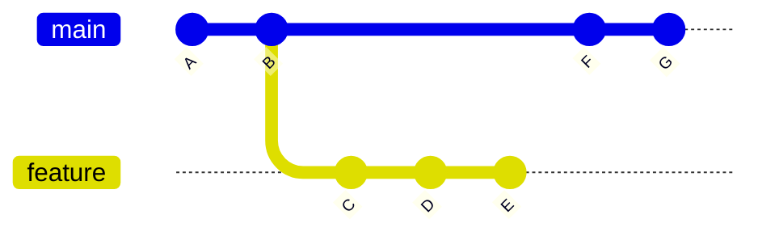
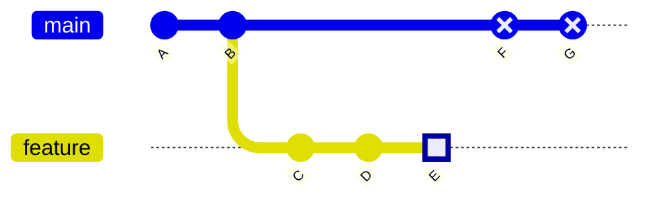
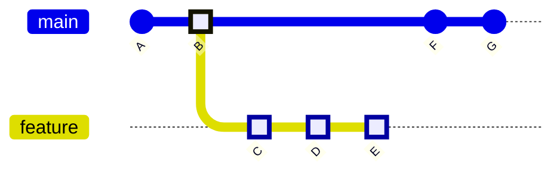

# cycle

A .NET CLI tool that generates a Solution Filter (`.slnf`) from a list of changed files. It evaluates MSBuild project graphs — including transitive dependencies, imports, and item references — so you can scope builds and tests in CI to only what changed.

## Installation

```bash
dotnet tool install --global cycle
```

## Usage

```bash
cycle <solution-path> <output-file> [options]
```

### Arguments

| Argument | Description |
|---|---|
| `solution-path` | Path to the solution file (`.sln` or `.slnx`) |
| `output-file` | Path to write the solution filter (`.slnf`) |

### Options

| Option | Description | Default |
|---|---|---|
| `--changed-files <path>` | File containing changed file paths (one per line) | |
| `--no-closure` | Exclude transitive build dependencies (ProjectReferences) from the filter | `false` |
| `--log-level <level>` | Log verbosity: `quiet`, `minimal`, `normal`, `verbose` | `minimal` |

Changed files are read from `--changed-files` if provided, otherwise from stdin when input is piped.

## Examples

Build and test only what changed on a feature branch:

```bash
git diff --name-only origin/main...HEAD | cycle MySolution.slnx affected.slnfdotnet build affected.slnf
dotnet test affected.slnf
```

Build only what changed in the most recent commit on main:

```bash
git diff --name-only HEAD~1...HEAD | cycle MySolution.slnx affected.slnfdotnet build affected.slnf
```

Use a file list:

```bash
cycle MySolution.slnx affected.slnf --changed-files changes.txt
```

## Two-dot vs three-dot diff

The examples above use `git diff --name-only A...B` (three dots). This matters when your branch has diverged from the base:



### Two-dot diff (`..`) — tip to tip

Compares G directly against E. The diff includes changes from both sides: files changed on main (F, G) and files changed on the feature branch (C, D, E). This leads to unrelated projects in the filter.



```bash
git diff --name-only main..feature   # compares G vs E
```

### Three-dot diff (`...`) — merge base to tip

Finds the common ancestor (B) and compares only what changed since that point. This gives you exactly the files the feature branch introduced.



```bash
git diff --name-only main...feature  # compares B vs E
```

Use three dots (`...`) for feature branches. For consecutive commits on the same branch (e.g. `HEAD~1...HEAD`), both forms are equivalent.

## Building from Source

```bash
dotnet build Cycle.slnx
dotnet test Cycle.slnx
dotnet pack Cycle.slnx
```

## License

[MIT](LICENSE)
