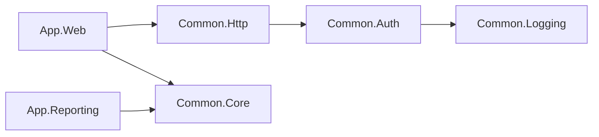
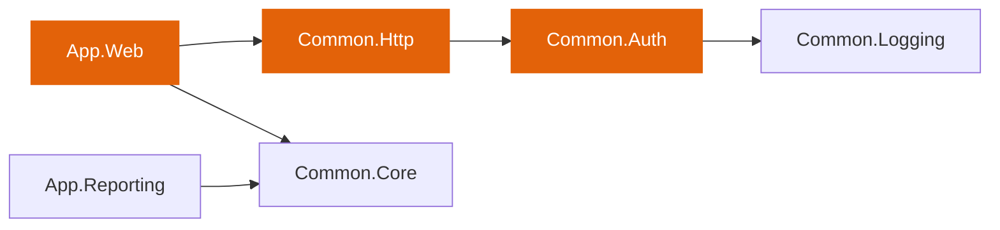
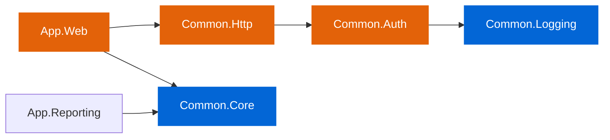
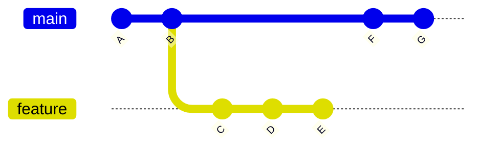
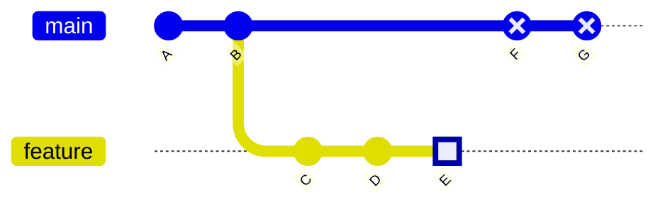
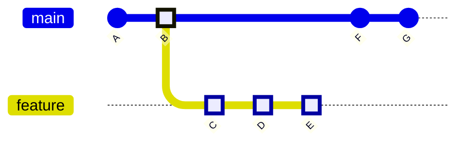

# cycle

A .NET CLI tool that generates a Solution Filter (`.slnf`) from a list of changed files. It evaluates MSBuild project graphs — including transitive dependencies, imports, and item references — so you can scope builds and tests in CI to only what changed.

## Intended audience

Cycle targets SDK-style .NET projects managed through solution files (.sln or .slnx). It has been tested in production against a multitargeted repository that ships both net8.0 and net472 assemblies. The tool was developed to speed up internal ci in a monorepo with roughly 260 projects where having separate pipelines for each service had become a bottleneck. The design prioritizes being simple, small, and testable over covering every possible build scenario.

The intended users are teams that maintain .NET solutions containing many projects and want to scope their CI builds and test runs to only the projects affected by a given change. Cycle is most useful when building the entire solution is too slow for a reasonable feedback loop and when manually maintaining solution filters is error-prone or impractical.

Cycle is not a fit for projects that do not use MSBuild as their build system. It also cannot detect coupling that exists only at runtime or by convention, such as shared serialization contracts, reflection-based dependencies, or message schemas defined independently across service boundaries. See the Known Limitations section for specific examples.

## Installation

```bash
dotnet tool install --global cycle
```

## Usage

```bash
cycle <solution-path> <output-file> [options]
```

### Arguments

| Argument | Description |
|---|---|
| `solution-path` | Path to the solution file (`.sln` or `.slnx`) |
| `output-file` | Path to write the solution filter (`.slnf`) |

### Options

| Option | Description | Default |
|---|---|---|
| `--changed-files <path>` | File containing changed file paths (one per line) | |
| `--no-closure` | Exclude transitive build dependencies (ProjectReferences) from the filter | `false` |
| `--log-level <level>` | Log verbosity: `quiet`, `minimal`, `normal`, `verbose` | `minimal` |

Changed files are read from `--changed-files` if provided, otherwise from stdin when input is piped.

## Examples

Build and test only what changed on a feature branch:

```bash
git diff --name-only origin/main...HEAD | cycle MySolution.slnx affected.slnfdotnet build affected.slnf
dotnet test affected.slnf
```

Build only what changed in the most recent commit on main:

```bash
git diff --name-only HEAD~1...HEAD | cycle MySolution.slnx affected.slnfdotnet build affected.slnf
```

Use a file list:

```bash
cycle MySolution.slnx affected.slnf --changed-files changes.txt
```

## How it works

Cycle processes a list of changed files through a pipeline of seven steps to produce a solution filter that includes only the affected projects and their build dependencies.

### 1. Input parsing

Changed file paths are read from the file specified via `--changed-files`, or from standard input when input is piped. Each path is normalized to an absolute path. Paths that cannot be resolved are logged and skipped.

### 2. Solution reading

The tool parses the solution file to discover all project paths contained in the solution.

### 3. Phantom file creation

Temporary placeholder files are created for any changed file that does not exist on disk. This is necessary because MSBuild evaluates project files by resolving all item includes and globs against the file system. Without these placeholders, projects that reference a deleted or renamed file would fail to evaluate correctly. The placeholders are cleaned up automatically when processing completes.

### 4. Project loading and evaluation

Each project from the solution is loaded into memory. For each project, the tool collects three sets of information: the resolved item paths (source files, content files, resources, and all other items after glob and property expansion), the import paths (all .props and .targets files pulled in during evaluation), and the ProjectReference paths (direct build dependencies on other projects). For projects that target multiple frameworks, items are collected by re-evaluating the project once per target framework to ensure framework-specific items are not missed.

### 5. Affected project detection

This step determines which projects are affected by the change. It runs in two phases: direct file matching, followed by reverse dependency propagation. The following example illustrates both phases.

Consider a solution with this dependency graph, where an arrow from A to B means A has a ProjectReference to B.



Suppose a source file inside Common.Auth has changed. The first phase checks each changed file against the resolved item paths and import paths collected in the previous step. The changed file matches Common.Auth, so Common.Auth is marked as directly affected.

The second phase starts from each directly affected project and walks the reverse dependency graph breadth-first. Every project that depends on an affected project through a ProjectReference is itself marked as affected. The traversal then continues from each newly affected project, repeating until no further dependents are found. In this example the walk makes two hops: Common.Http references Common.Auth and is marked as affected in the first hop, then App.Web references Common.Http and is marked as affected in the second hop. App.Reporting does not depend on any affected project and remains outside the affected set.



The highlighted nodes represent the affected set after this step: Common.Auth as a direct match, Common.Http as a first-hop reverse dependent, and App.Web as a second-hop reverse dependent.

Projects that failed to load during project evaluation are unconditionally added to the affected set. This prevents build failures from being silently masked in CI.

### 6. Transitive closure

This step ensures that every project needed to compile the affected set is included in the solution filter. It runs by default and can be disabled with `--no-closure`.

Starting from the affected projects identified in step 5, a breadth-first traversal walks the forward dependency graph. For each affected project, the tool follows its outgoing ProjectReferences and adds the referenced projects to the filter. The traversal continues until all reachable build dependencies have been included.

Continuing the example, App.Web has a ProjectReference to Common.Core, so Common.Core is added. Common.Auth has a ProjectReference to Common.Logging, so Common.Logging is added. The remaining forward references point to projects already in the affected set and do not add anything new. The final filter contains every project needed to compile the affected set.



The orange nodes are the affected projects from step 5. The blue nodes are build dependencies added by the closure. Together they form the complete set written to the solution filter. App.Reporting is the only project excluded from the filter in this example.

References that point to projects outside the solution cannot be included in the filter. These are reported as warnings but do not prevent the filter from being generated.

### 7. Output generation

The affected project paths are made relative to the solution directory and written as a standard .slnf file in JSON format. A summary line is written to stderr reporting the total number of projects in the solution, the number included in the filter, and the number that failed to load.

## Two-dot vs three-dot diff

The examples above use `git diff --name-only A...B` (three dots). This matters when your branch has diverged from the base:



### Two-dot diff (`..`) — tip to tip

Compares G directly against E. The diff includes changes from both sides: files changed on main (F, G) and files changed on the feature branch (C, D, E). This leads to unrelated projects in the filter.



```bash
git diff --name-only main..feature   # compares G vs E
```

### Three-dot diff (`...`) — merge base to tip

Finds the common ancestor (B) and compares only what changed since that point. This gives you exactly the files the feature branch introduced.



```bash
git diff --name-only main...feature  # compares B vs E
```

Use three dots (`...`) for feature branches. For consecutive commits on the same branch (e.g. `HEAD~1...HEAD`), both forms are equivalent.

## Known Limitations

Cycle traces the **MSBuild project graph** — `ProjectReference`, imports, and item references. Coupling that exists only at runtime or by convention is invisible to it.

The most common example is **serialization contracts across service boundaries**. Two services independently define the same JSON object — one serializes it, the other deserializes it. If the contract changes in one project, cycle has no way to know the other project is affected because there is no build-level dependency linking them. Integration or end-to-end tests that cover that contract will not be included in the filter.

The same applies to any implicit contract that lives outside the build graph: shared message schemas, REST or gRPC contracts defined independently in each service, database schemas, or configuration files consumed across service boundaries.

## Building from Source

```bash
dotnet build Cycle.slnx
dotnet test Cycle.slnx
dotnet pack Cycle.slnx
```

## License

[MIT](LICENSE)
